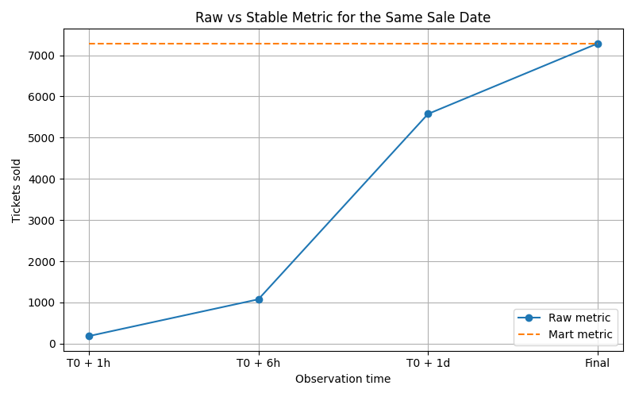

# Metric Instability in Real-Time Ticket Sales Pipelines

With the FIFA World Cup 2026 coming up in a few months, event organizers and planners closely track ticket sales to plan logistics, staffing, and security. Demand is high and many users try to book tickets at the same time.

In a real setup, ticket bookings pass through multiple systems such as the booking platform, payment gateway, and downstream processors. Not all events arrive at the same time, and some events get reported more than once due to retries, network delays, or system failures. As a result, the same ticket purchase can appear late or appear twice in the data.

This project simulates that reality and shows how raw sales numbers can change over time, and how a data pipeline can eventually produce stable and reliable metrics.

## Overview
In real-time data systems, business metrics often change after they are first reported.  
A dashboard queried today can show different numbers tomorrow, even for the same date. 

This project demonstrates why metrics become unstable, how late and duplicate data cause drift, and how to design a pipeline that eventually stabilizes metrics.  

---

## The Problem

Business users often ask:
> “How many tickets were sold on December 20?”

As data engineers we often take time to go back to the logs and check what is really causing the issue. The problem is not the metrics only by themselves but also the added panic, hours of debugging and potential financial disasters.

In this project, I built a robust pipeline that de-duplicates redundant transactions and reports consistent metrics.

In production systems:
- Events arrive late  
- Streaming systems deliver data incrementally  
- Messages can be duplicated  
- Pipelines use *at-least-once* delivery guarantees  

As a result:
- Early metrics are incomplete  
- Numbers change retroactively  
- Dashboards can lose trust  

---

## This Project Demonstrates

### Late-Arriving Data
Ticket purchase events are ingested hours or days after purchase, simulating:
- Network delays  
- Backlogs  
- Streaming retries  

### Duplicate Events
A small percentage of events are replayed with different ingestion timestamps, mimicking:
- Kafka *at-least-once* delivery  
- Consumer restarts  
- Retry logic  

### Metric Instability
Metrics computed at different observation times can produce different results for the same sale date.

### Metric Stabilization
Metrics converge and stabilize when:
- Data is **deduplicated by `ticket_id`**
- **`purchase_timestamp`** is treated as the event time(in our case the ticket purchase)
- Data flows through **raw**, **staging**, and **mart** layers

---

## Architecture

Python Producer
↓
Kafka (ticket_purchases_raw)
↓
Spark Structured Streaming
↓
Parquet (append-only, late + duplicate data)
↓
DuckDB (raw ingestion)
↓
dbt
├── staging (deduplication & cleaning)
└── marts (business metrics)

---

## Data Model

### Raw Events — `raw.ticket_events`
| Field | Description |
|-------|--------------|
| ticket_id | Unique ticket purchase ID |
| match_id | Identifier for the match |
| purchase_timestamp | When the ticket was actually bought |
| ingest_timestamp | When the event arrived in the pipeline |
| ticket_type | Category of the ticket |
| quantity | Number of tickets in the order |
| price | Amount spent in buying all the tickets in the order |

This table intentionally contains:
- Late arrivals  
- Duplicates  
- Out-of-order ingestion

---

## dbt Models

### Staging Model — `stg_ticket_purchases`
**Purpose:** Remove duplicates and retain one canonical record per ticket.  
**Logic:**
ROW_NUMBER() OVER (
PARTITION BY ticket_id
ORDER BY purchase_timestamp, ingest_timestamp
)

### Mart Model — `fct_daily_sales`
**Purpose:** Produce stable, business-ready metrics.  
**Metrics:**
- Tickets sold  
- Revenue  
- Quantity  
- Ticket type breakdown  

**Grouped by:**
- Sale date  
- Match  
- Teams  
- Stadium  

---

## Metric Instability Analysis

To demonstrate drift, the same sale date is observed at different ingestion times:

| Observation Time | Tickets Sold |
|------------------|--------------|
| T0 + 1 hour | 183 |
| T0 + 6 hours | 1,076 |
| T0 + 1 day | 5,575 |
| Final | 7,285 |

If you look at this carefully, you will observe that for the same sale date, you will observe varying entries across different observation times.

---

### Mart Model
With the Mart model for the same sale 20th December, observe the stability,

## Visualization

The project includes a plot (`metric_instability.csv`) showing how ticket counts for a single sale date evolve over time:

- Early queries undercount sales  
- Late data corrects the metric  
- Final numbers stabilize only after ingestion completes  

Generated using **Matplotlib**.

---

## Technology Stack
- **Python** — data generation and Kafka producer  
- **Kafka** — event streaming  
- **Apache Spark** — structured streaming ingestion  
- **Parquet** — append-only storage  
- **DuckDB** — analytical database for exploration  
- **dbt** — transformations and metrics modeling  
- **Matplotlib** — metric instability visualization  

---

## Getting Started
1. Run the Python producer to generate and stream ticket events.  
2. Start Spark Structured Streaming to consume from Kafka and write to Parquet.  
3. Load Parquet data into DuckDB.  
4. Execute dbt models for staging and mart layers.  
5. Visualize metric evolution using the provided notebook.

